<div align="center">


# Defense

**An offline iOS study companion for a PhD defense.**

Flashcards, quizzes, formulas with plots, and a browsable graph of terms —
compiled from a research vault, scheduled by FSRS, no network.

<sub>iOS 26 · Swift 6 · SwiftUI + SwiftData + Swift Charts · zero dependencies · MIT</sub>

</div>

---

| Today | A law, with its shape | Structure, drawn |
|---|---|---|
| 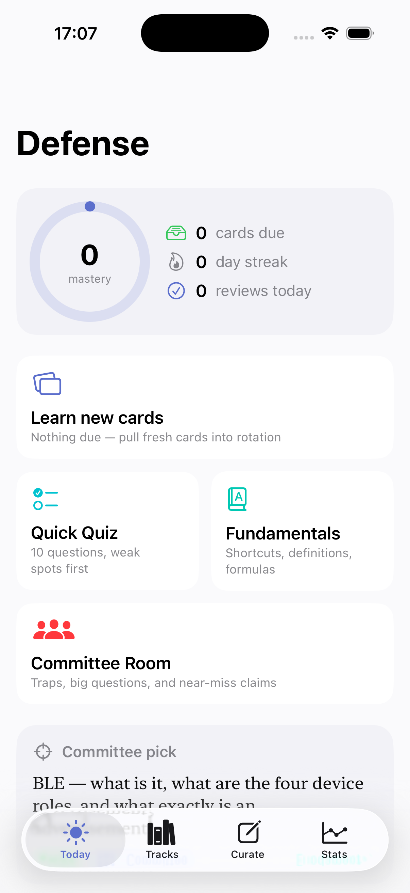 | 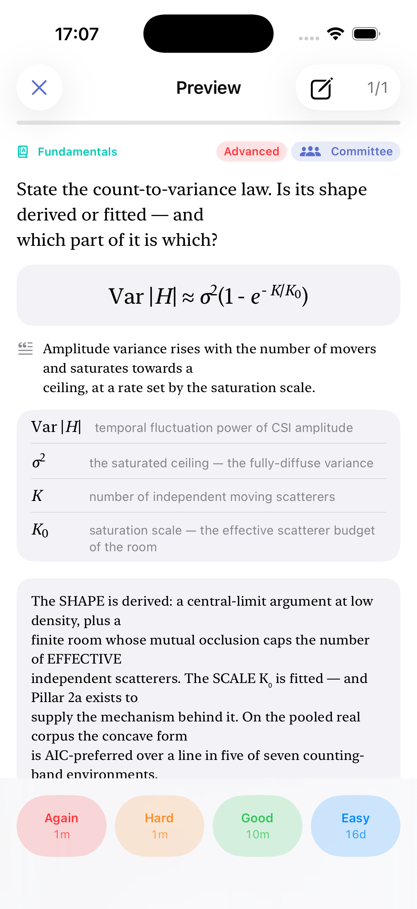 | 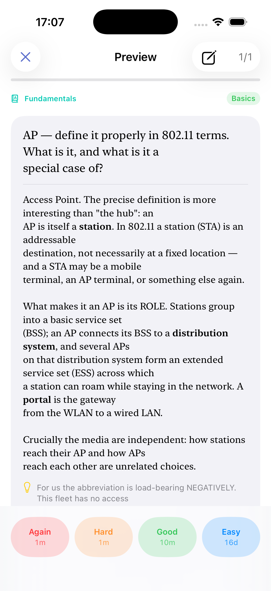 |

| Real measured data | Where a term leads | Dark |
|---|---|---|
| 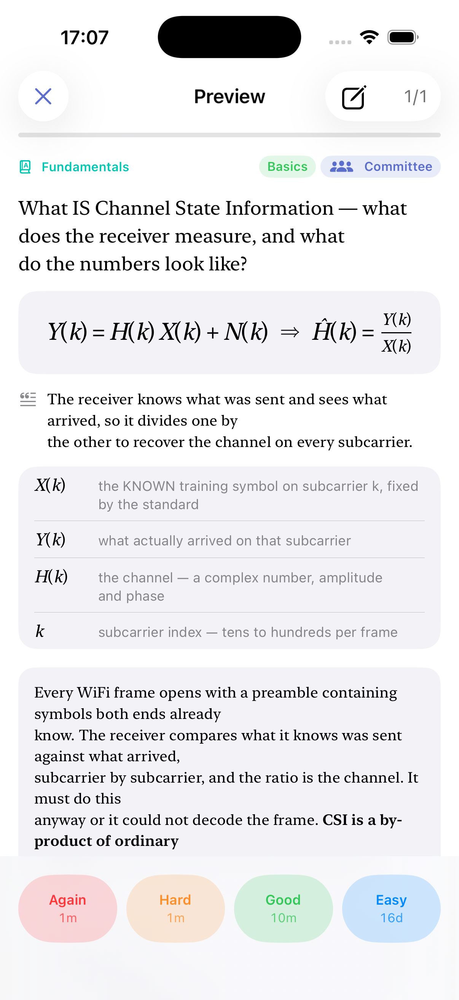 | 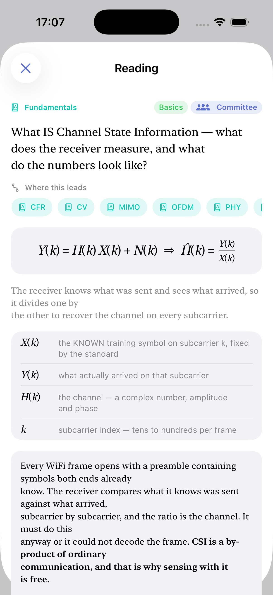 | 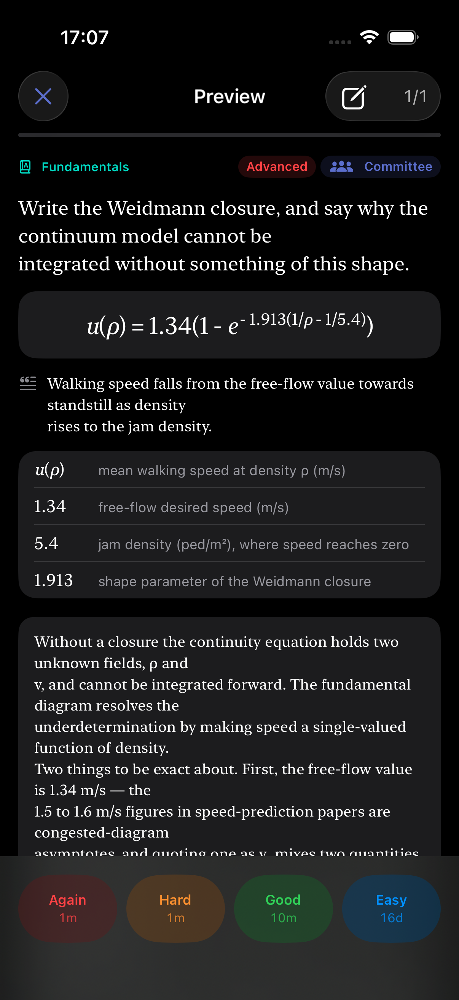 |

---

## What it is

A personal, single-user app. It holds the vocabulary, the laws, the hypotheses
and the committee traps of one thesis, and it drills them on a spaced-repetition
schedule until they are available under pressure.

- **No network, no analytics, no account.** Content ships in the app bundle;
  progress lives on-device in SwiftData. Nothing leaves the phone.
- **No third-party dependencies.** The maths typesetter, the figure renderers
  and the FSRS scheduler are all in this repo — 4,400 lines of Swift.
- **Content is compiled, not written here.** Cards come from Obsidian deck notes
  in the parent research repo, via one explicit command.

It is published because the app is a reusable thing and the pipeline behind it
is worth reading, not because it is a product. There is no roadmap, no release
and no support. See [Scope](#scope).

## Cards

Three kinds, all in one FSRS queue.

| kind | what it asks |
|---|---|
| `flash` | front → back, graded Again / Hard / Good / Easy |
| `mcq` | one right answer; distractors are **intentionally false near-miss claims**, several encoding documented mis-citation traps |
| `formula` | state the law — reveal shows it typeset, a symbol table, and a plot of what it *does* |

Every card kind can carry figures, and every card can link to other cards.

A trap card, revealed — the wrong option has to be *tempting* to do its job:

<div align="center">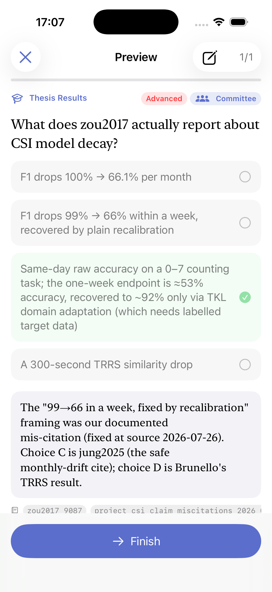</div>

### Figures

Five kinds, one list per card, discriminated by `kind`.

| kind | what it is for |
|---|---|
| `plot` | curves **sampled at compile time**, so the app needs no expression evaluator |
| `diagram` | labelled nodes and edges on a normalised canvas, drawn with native shapes |
| `image` | a bundled raster — the one case the others cannot serve: what real measured data looks like |
| `table` | values that are a list rather than a shape; never scrolls sideways |
| `sequence` | actors and the ordered messages between them, laid out from the order |

| Interactive plot | Table | Sequence | Diagram |
|---|---|---|---|
| 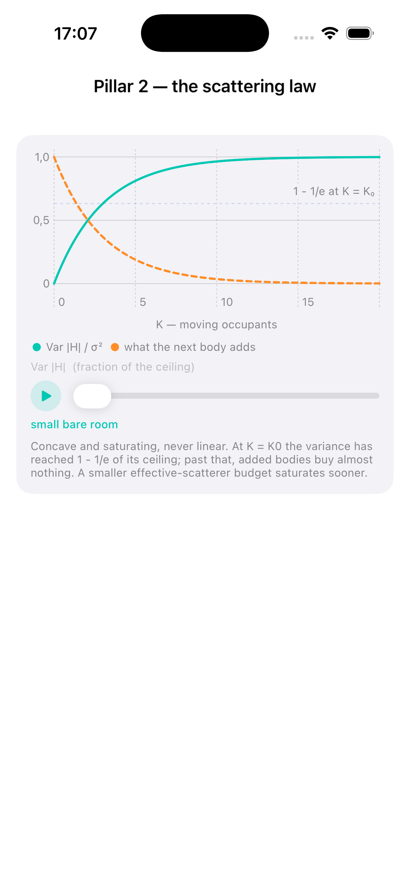 | 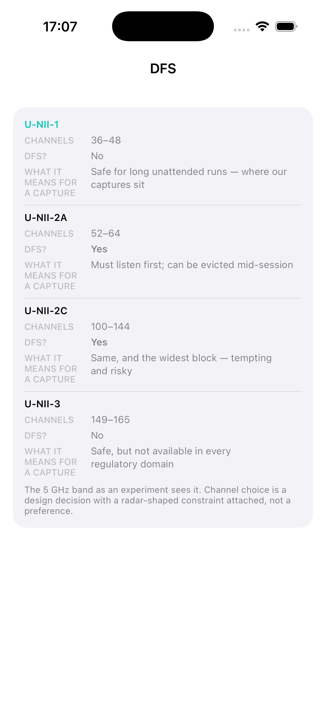 | 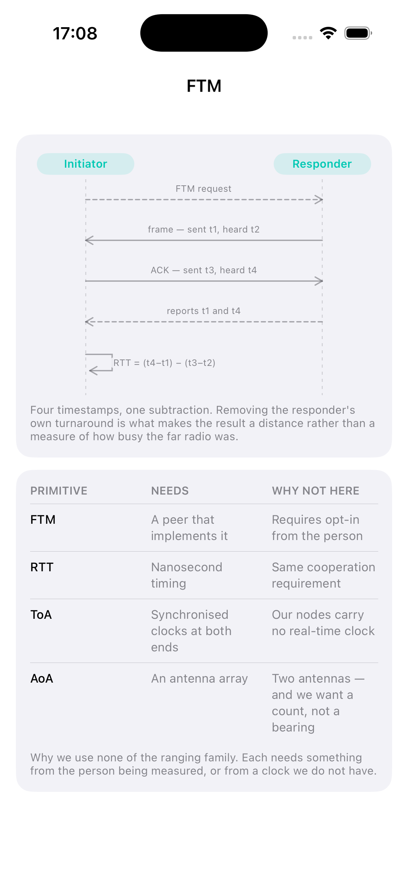 | 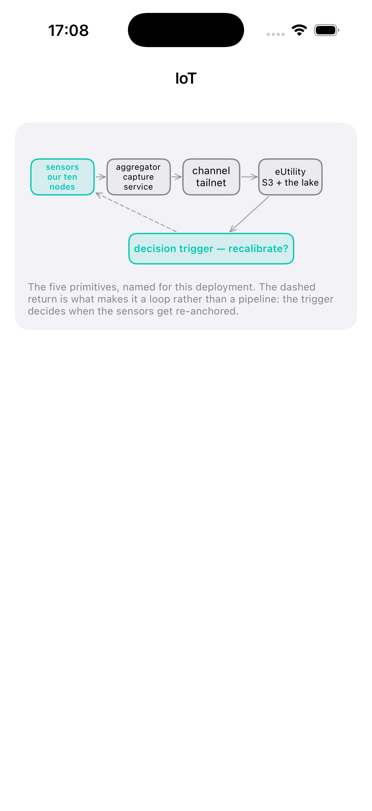 |

Nothing but `image` is a raster, so every figure scales with the reader's type
size and is correct in dark mode by construction. A `plot` may declare a swept
**parameter**: the compiler samples one frame per value, and the app scrubs
between them. Interactivity therefore costs the phone nothing, and the slider
can only land on a state the author chose to show.

An unknown `kind` renders as a placeholder rather than failing to decode, so a
bank compiled by a newer pipeline degrades instead of crashing at launch.

Full field-by-field reference: [docs/DECK-BANK.md](docs/DECK-BANK.md).

### The card graph

Terms do not live alone. A card declares `see_also:` and the compiler makes
every link **symmetric**, so there are no one-way streets — from CSI you reach
OFDM, and from OFDM you can walk back.

Following a link opens a read-only reader, which can be walked onward to any
depth. It deliberately does **not** grade the card or move it in the queue:
curiosity must not corrupt the schedule.

### Maths

`Views/MathTypeset.swift` parses a restricted LaTeX subset — greek, `\frac`,
`\sqrt`, sub- and superscripts, `\sum` with limits, accents, `\mathrm`,
`\mathbf`, the usual relations — into a node tree laid out with SwiftUI.
Fractions and big operators sit on the maths axis, not the text baseline. A long
formula shrinks to fit before it becomes a horizontal scroller.

Anything it cannot parse falls back to the raw source in monospace. A formula
that renders as its own LaTeX is ugly; one that crashes the session is worse.

## Content

Content is not written here. It is compiled from vault deck notes into
`MonadDefense/Resources/DeckBank.json` plus a `Figures/` directory, by an
explicit command in the parent repo — never by a build phase:

```bash
uv run monad-knowledge edu deck spine --apply   # re-render the RQ deck
uv run monad-knowledge edu deck validate        # anchors and figures must resolve
uv run monad-knowledge edu deck compile         # → DeckBank.json + Figures/
```

Then rebuild.

Review progress is keyed by **stable card ids** and survives a content update; a
card whose id disappears is orphan-pruned at next launch. Keeping the refresh
out of the build keeps the build fast and offline, at the cost of a stale bank
being invisible — so the app states its content's age on the Today screen once
it passes a threshold.

The **Curate** tab closes the loop the other way: sweep the bank with the
answers open, one verdict per card (`keep` / `more` / `fix` / `cut`) plus a note,
export as JSON, and map the verdicts back onto the deck notes that own each card.

Both loops: [docs/CONTENT.md](docs/CONTENT.md).

### Provenance

Cards carry two provenance fields, rendered as distinct chips.

- **`anchors`** — validated knowledge-base identifiers: argument-chain links
  (`<chapter>.<slug>`) and hypothesis slugs, the same identifiers the thesis's
  `\kb…` LaTeX macros carry. An unresolvable anchor fails validation.
- **`sources`** — free-form provenance. Never validated.

The **research-question deck is generated, not written**: it is rendered from
the same declaration the thesis itself renders from, so a rehearsed question
cannot drift from the asked one.

## Build

```bash
xcodebuild -project MonadDefense.xcodeproj -scheme MonadDefense \
  -destination 'generic/platform=iOS Simulator' build
```

Or open `MonadDefense.xcodeproj` in Xcode 26+. A simulator build needs no
configuration.

To sign for a device, copy `Configuration/Local.xcconfig.example` to
`Configuration/Local.xcconfig` (gitignored) and put your team id in it.

Files under `MonadDefense/` are included automatically — the project uses a
hand-authored `project.pbxproj` with `PBXFileSystemSynchronizedRootGroup`, so
adding a source file or a resource needs no project edit.

More, including the screenshot pipeline and the conventions:
[docs/DEVELOPMENT.md](docs/DEVELOPMENT.md).

## Documentation

| | |
|---|---|
| [docs/ARCHITECTURE.md](docs/ARCHITECTURE.md) | the four layers, the two stores, FSRS, figures, the graph |
| [docs/DECK-BANK.md](docs/DECK-BANK.md) | `DeckBank.json` field by field — the contract with the compiler |
| [docs/CONTENT.md](docs/CONTENT.md) | the authoring loop and the curation loop |
| [docs/DEVELOPMENT.md](docs/DEVELOPMENT.md) | build, signing, layout, conventions, screenshots |

## Design

The mark is a sibling of the `monad-app` icon: the same M in ink navy
(`#0F142F`), the same three arcs in periwinkle (`#5B6ECC`). monad-app's arcs
radiate outward — a measurement leaving. These are mirrored to open toward the
M, and the accent roles are swapped, so the two read as a family while staying
distinguishable at dock size.

Sources are in `design/` as hand-authored SVG; `Views/Theme.swift` carries the
same palette for the places the asset catalogue cannot reach.

## Scope

This is one researcher's instrument, published for reading rather than for use.

- **No support and no issue triage.** Fork it if it is useful.
- **No tests.** A stated gap: `FSRS` and the `MathTypeset` parser are the two
  pieces that would repay a test target, and neither is covered.
- **Single user by construction.** There is no sync, no multi-profile support
  and no account, and adding any of them would mean adding a network layer the
  design exists to avoid.
- **The compiler lives elsewhere.** This repo cannot regenerate its own content;
  it can only render a bank somebody else compiled.

## Licence

The **software** is MIT — see [LICENSE](LICENSE).

The **study content** is not. `MonadDefense/Resources/`, and the screenshots
that show card faces, are the text and the measured results of a doctoral thesis
in progress. They ship here so the app is legible and reproducible, and all
rights to them are reserved.

Reuse the app; recompile it against your own bank.
